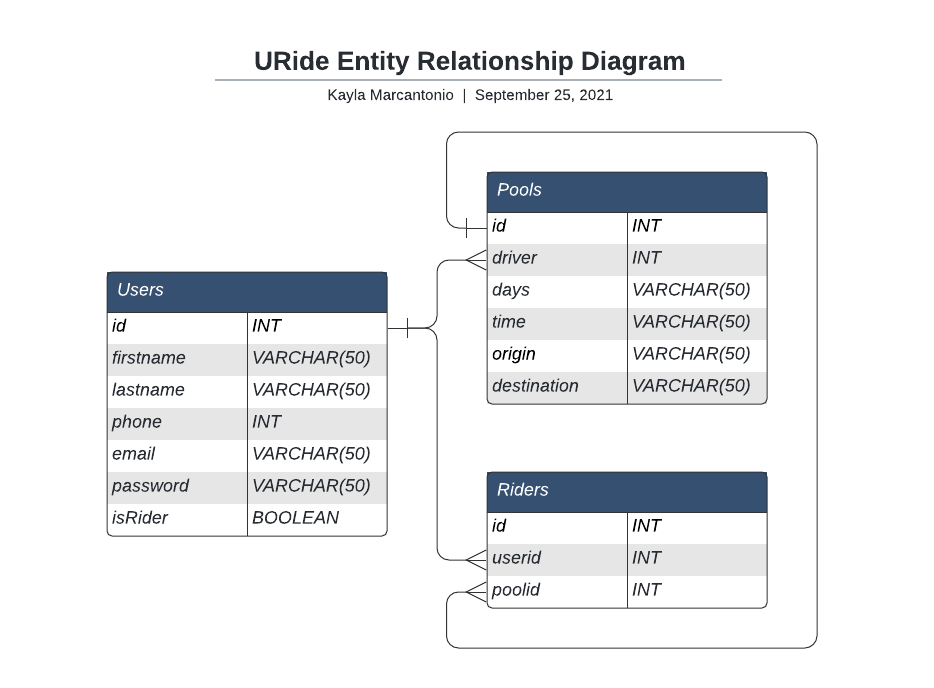

# U-Ride 🚗
[u-ride.tech](u-ride.tech)

U-Ride is a carpooling app for College students to get to and from campus.
Focused on scheduling it matches you to students nearby with similar schedules to alleviate campus parking and emissions.

A ShellHacks 2021 project by **Kayla Marcantonio**, **Nathan Lim**, **Nicholas Yardich**
## Authors

- **Kayla Marcantonio** (UCF)
- **Nathan Lim** (UCF)
- **Nicholas Yardich** (UCF)
# Built With
- Google Maps API
- Google Places API
- LAMP Stack
- HTML/CSS/JavaScript
- MySQL
- PHP
- DigitalOcean

# Documentation

## Figma:
[U-Ride Figma](https://www.figma.com/file/3rOT2atuk4ah9Wa5IDjHkw/URide?node-id=30%3A27)

## Entity Relationship Diagram:
